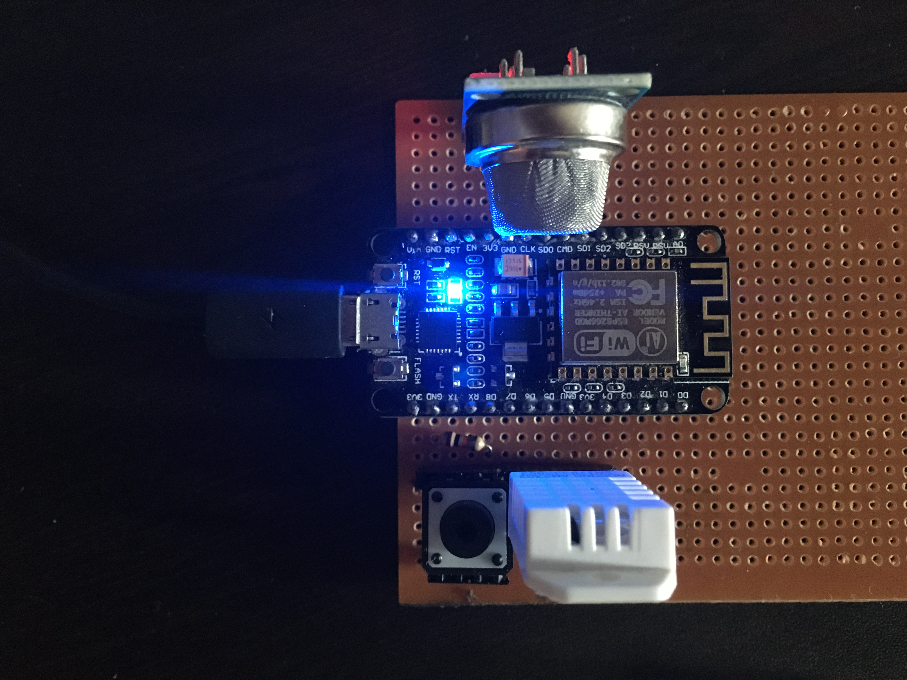
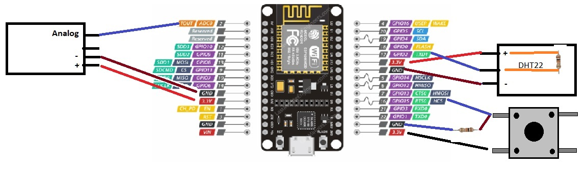

This IOT Project is Temperature monitoring system using MQTT and Publish to MQTT Broker. 

<B>Features of this project.</B>

<B> 1. Customizable Wifi </B>  

a. Included Tzapu Wifi Manager to make this device portable.  
b. Device can be configured with push button (press > 3000ms) to re-start and configure new AP  

<B> 2. OTA </B>  

a. Included hallard/EspMQTTClient, changed qos to 1. (file is local here)  
b. In browser type http://esp8266client.local  
c. Username is MQTT username and MQTT password  
d. OTA can be performed using Firmware update  

<B> 3. Modular design with different C++ files </B>  

<B> 4. Used Digital Ocean droplet (Installed Debian and installed Mosquitto MQTT broker, Nodered) One can use Ubuntu or any linux </B>  

<B> 4. Components used: </B>  
1. Esp8266 - 30 pin version
2. DHT22 & 10K resistor (between Positive (+) and data pin (middle))
3. MQ2 
4. Push button and 10K resistor

