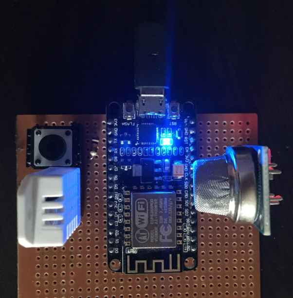

This IOT Project is Temperature monitoring system using MQTT and Publish to MQTT Broker. 

Features of this project.

1. Customizable Wifi

1.a. Included Tzapu Wifi Manager to make this device portable. 
1.b. Device can be configured with push button (press > 3000ms) to re-start and configure new AP

2. OTA

2.a. Included hallard/EspMQTTClient, changed qos to 1. (file is local here)

2.b. In browser type http://esp8266client.local 

2.c. Username is MQTT username and MQTT password

2.d. OTA can be performed using Firmware update

  
3. Modular design with different C++ files

4. Used Digital Ocean droplet (Installed Debian and installed Mosquitto MQTT broker, Nodered) One can use Ubuntu or any linux

Components used:
1. Esp8266 - 30 pin version
2. DHT22 & 10K resistor (between Positive (+) and data pin (middle))
3. MQ2 
4. Push button and 10K resistor

